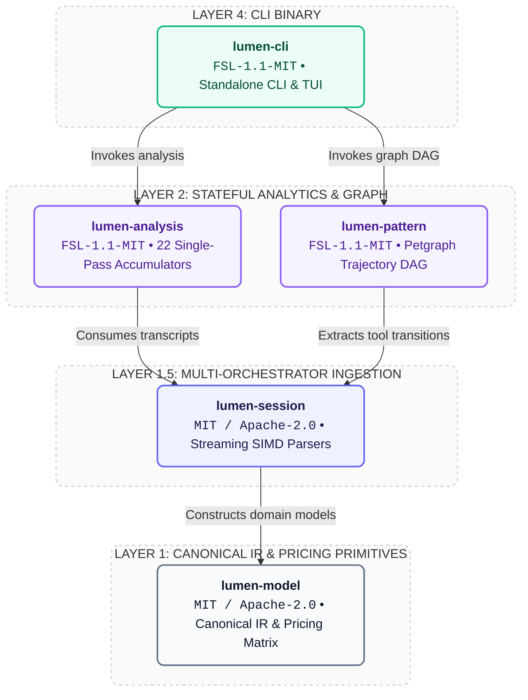
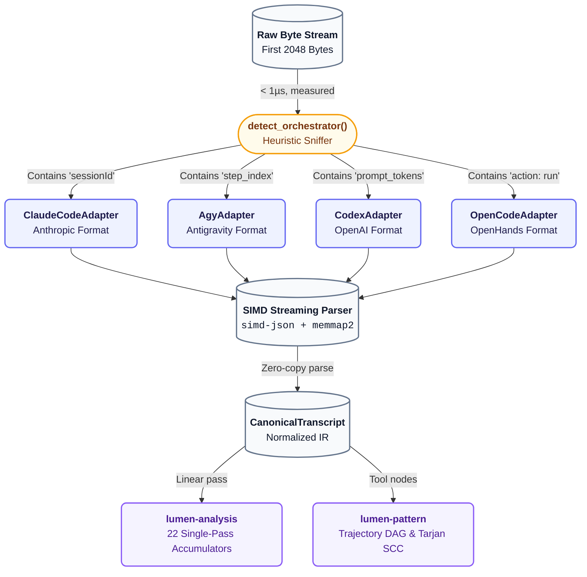

# Lumen Architecture (`ARCHITECTURE.md`)

This document defines the crate architecture, dataflow pipeline, memory layout, and mathematical invariants of Lumen.

---

## 1. Crate Hierarchy & Licensing Boundaries

---

## 2. Ingestion Pipeline & Auto-Fingerprinting

---

## 3. Mathematical Formulations & Prompt Cache Economics

### A. Turn Cost Formulation:
$$\text{Cost}(t) = \frac{I_{\text{uncached}}(t) \cdot P_{\text{in}} + I_{\text{write}}(t) \cdot P_{\text{write}} + I_{\text{read}}(t) \cdot P_{\text{read}} + O(t) \cdot P_{\text{out}}}{1,000,000}$$

### B. Prompt Cache Hit Ratio ($H$):
$$H = \frac{\sum_{t=1}^N I_{\text{read}}(t)}{\sum_{t=1}^N \left( I_{\text{uncached}}(t) + I_{\text{write}}(t) + I_{\text{read}}(t) \right)} \times 100\%$$

### C. Financial Efficiency Multiplier ($\eta$):
$$\eta = \frac{\text{Baseline Cost (No Cache)}}{\text{Actual Cost With Prompt Caching}}$$

---

## 4. Tarjan SCC Cycle Detection

Tool transitions are represented as directed graph $G = (V, E)$. Tarjan's Strongly Connected Components algorithm identifies non-trivial components with cycle depth $\ge 3$ where all nodes share identical target symbols and zero state mutations, flagging anomalous circular exploration loops.
