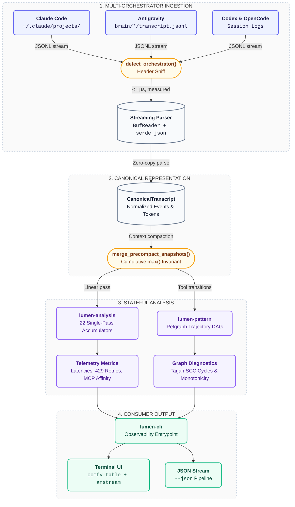
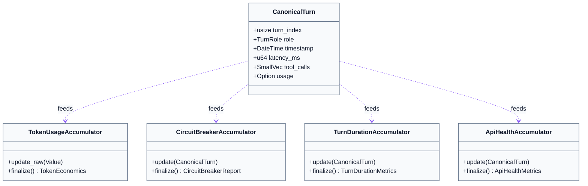

<div align="center">

# Lumen

**Transcript parser, prompt cache accountant, and trajectory analyzer for AI coding agents.**

[](https://github.com/orin-axi/lumen/actions)
[](https://functional-source-license.com/1.1/)
[](https://www.rust-lang.org)
[](https://github.com/orin-axi/lumen)

[Overview](#overview) • [Pipeline](#architecture-pipeline) • [Features](#features) • [Installation](#installation) • [CLI Reference](#cli-reference) • [Rust SDK](#rust-crate-usage) • [Benchmarks](#benchmarks)

</div>

---

## Overview

AI coding agents (Claude Code, Antigravity, Codex, OpenCode) write transcript logs containing tool calls, latency timestamps, token counters, and subagent trees.

**Lumen** parses these raw logs, normalizes them into a canonical representation (`CanonicalTranscript`), calculates exact prompt cache savings using Anthropic's 4-tier pricing model, and detects circular search loops using Tarjan's Strongly Connected Components algorithm.

---

## Architecture Pipeline



---

## Comparative Matrix

> **Note:** The table below describes capability presence, not measured performance — Lumen has not been benchmarked head-to-head against these tools, and the figures previously shown here for other projects were not independently verified. See [Benchmarks](#benchmarks) for Lumen's own measured numbers.

| Capability | Lumen | OpenTelemetry GenAI | Arize Phoenix | LangSmith |
| :--- | :---: | :---: | :---: | :---: |
| **Anthropic Cache-Tier Math (3 of 4 tiers implemented)** | **Native** | Manual calculation | Partial | Partial |
| **Tarjan SCC Tool Cycle Detection** | **Native ($O(V+E)$)** | No | No | No |
| **Context Compaction Merge** | **$\max()$ Snapshot Merge** | Lossy / Double counts | No | No |
| **Multi-Orchestrator Support** | **Claude, AGY, Codex, OpenCode** | OTel Traces Only | Python Traces Only | LangChain Only |

---

## Features

- **Multi-Orchestrator Ingestion**: Auto-fingerprints and parses Claude Code, Antigravity, Codex, and OpenCode logs with zero-copy SIMD acceleration.
- **Prompt Cache Economics**: Calculates 4-tier token costs (uncached input, 5m write premium, 0.10x cache read discount, output) and net USD savings.
- **22 Streaming Accumulators**: Single-pass $O(N)$ extraction of turn latency percentiles (p50/p95), rate limits (429/5xx), MCP tool affinity, and self-correction pivots.
- **Trajectory Cycle Detection**: Models tool calls as a directed graph using `petgraph` and detects circular exploration loops with Tarjan's SCC algorithm.
- **PreCompact Snapshot Merging**: Applies $\max()$ cumulative token merge invariants across compacted sessions to eliminate double-counting.
- **Terminal UI**: Outputs formatted tables using `comfy-table` with `anstream` ANSI handling and snapshot-testable `--json` output.

---

## Installation

Lumen crates are not yet published to crates.io, so `cargo install lumen-cli` and
`cargo binstall` don't work yet, and there is no `install.sh` or Homebrew tap. Until
the first crate publishes, build from source:

```bash
git clone https://github.com/orin-axi/lumen.git
cd lumen
cargo build --release --workspace
./target/release/lumen --help
```

---

## CLI Reference

### 1. Audit Session Economics (`lumen audit`)

Audit token spend, 5m cache writes, 90% discount cache reads, and net USD savings:

```bash
lumen audit ~/.claude/projects/-Users-gabe-Projects-agent-plugins/ef175eb8-0825-4122-934b-326fb85c2492.jsonl
```

```text
 Token Economics & Cache Audit: ef175eb8-0825-4122-934b-326fb85c2492
 Model: claude-3-5-sonnet-20241022

╭─────────────────────────────┬─────────╮
│ Metric                      ┆ Value   │
╞═════════════════════════════╪═════════╡
│ Uncached Input Tokens       ┆ 16      │
│ Cache Creation (5m Write)   ┆ 187,559 │
│ Cache Read (0.10x Discount) ┆ 461,506 │
│ Output Tokens               ┆ 1,030   │
│ Cache Hit Ratio             ┆ 71.1%   │
│ Actual USD Spend            ┆ $0.8573 │
│ Baseline Cost (No Cache)    ┆ $1.9627 │
│ Net Savings USD             ┆ $1.1054 │
│ Efficiency Multiplier       ┆ 2.29x   │
╰─────────────────────────────┴─────────╯
```

> [!TIP]
> Use `--json` for machine-readable output:
> ```bash
> lumen audit session.jsonl --json | jq .economics.cache_hit_ratio
> ```

---

### 2. Trace Execution Trajectory (`lumen trace`)

Render chronological tool calls, turn latencies, and token counters:

```bash
lumen trace ~/.claude/projects/-Users-gabe-Projects-agent-plugins/ef175eb8-0825-4122-934b-326fb85c2492.jsonl
```

```text
 Session Trajectory: ef175eb8-0825-4122-934b-326fb85c2492
 Orchestrator: ClaudeCode | Model: claude-3-5-sonnet-20241022
 Turns: 14 | Wall Time: 12500ms

╭──────┬───────────┬──────────────────────────────────┬─────────────────────────────────╮
│ Turn ┆ Role      ┆ Tool Invocations                 ┆ Tokens (In / Write / Read / Out)│
╞══════╪═══════════╪══════════════════════════════════╪═════════════════════════════════╡
│ 0    ┆ User      ┆ -                                ┆ -                               │
│ 1    ┆ Assistant ┆ view_file(call_01)               ┆ 16 / 187559 / 0 / 120           │
│ 2    ┆ Assistant ┆ grep_search(call_02)             ┆ 0 / 0 / 187559 / 340            │
│ 3    ┆ Assistant ┆ replace_file_content(call_03)    ┆ 0 / 0 / 187559 / 570            │
╰──────┴───────────┴──────────────────────────────────┴─────────────────────────────────╯
```

---

### 3. Ingest and Query the SQLite Store (`lumen ingest` / `lumen sessions` / `lumen session`)

`trace` and `audit` inspect one file at a time without touching disk. `ingest` parses every real
session found at a path (a single file, or every file in a directory; an OpenCode SQLite database
persists every real session it contains) and persists it to a local SQLite store, so it can be
queried back later without re-parsing:

```bash
lumen ingest ~/.claude/projects/-Users-gabe-Projects-agent-plugins/
lumen ingest ~/.local/share/opencode/opencode.db

lumen sessions --provider claude-code
lumen session claude-code ef175eb8-0825-4122-934b-326fb85c2492
```

The store defaults to `~/.lumen/lumen.db`; override it with `--db <path>`. A session whose model
has no seeded pricing row reports its cost as an explicit `unknown`, never a fabricated dollar
figure.

---

## Accumulators

Lumen processes transcript streams using zero-allocation accumulators: 19 run in the main
per-turn pass, `token_usage` is computed once from the transcript's rolled-up economics rather
than per-turn, `otel_correlation` finalizes from the whole transcript rather than accumulating
per-turn, and `hook_activity` is implemented but not yet wired into the analysis engine.



<details>
<summary><b>Accumulator Catalog (Click to Expand)</b></summary>

| Accumulator | Output |
| :--- | :--- |
| **`token_usage`** | 4-tier token counters and USD cost |
| **`circuit_breaker`** | Consensus iterations between agent pairs; flags stalls ($>2$ rounds) |
| **`turn_duration`** | Latency percentiles (p50, p95, avg) across assistant turns |
| **`api_health`** | 429 rate limit backoffs and 5xx server retries |
| **`mcp_affinity`** | Ratio of structured MCP tools vs fallback shell commands |
| **`self_correction`** | Immediate parameter retries and approach pivots |
| **`schema_extractor`** | Extracts and validates embedded `spec@1`, `plan@1`, and `changeset@1` JSON |
| **`otel_correlation`** | Maps local `sessionId` to OpenTelemetry `requestIds` |
| **`span_mapping`** | Maps discrete `tool_use_id` invocations to child OTel spans |
| **`stats`** | Top tools, token distributions, user-to-assistant turn ratios |
| **`timeline`** | Groups assistant streaks and flags idle gaps ($>5\text{m}$) |
| **`artifacts`** | Created/edited file paths, git commits, PR links |
| **`flow`** | Unbroken autonomous tool streaks and permission blocks |
| **`tool_inventory`** | Active vs unused MCP tools |
| **`context_growth`** | Context growth rate and compaction events |
| **`permission_mode`** | Bypass vs standard approval permission states |
| **`hook_activity`** | Lifecycle hook execution durations and block rates |
| **`pr_link`** | Correlates transcripts with GitHub PR URLs |
| **`fuzzy_tools`** | Levenshtein clustering for tool name typos |
| **`attribution`** | Hierarchical token spend: Plugin $\to$ Skill $\to$ Subagent |
| **`autonomy`** | Autonomous completions vs user-interrupted runs |
| **`trajectory_dag`** | Feeds tool nodes to Petgraph DAG for cycle detection |

</details>

---

## Rust Crate Usage

Not yet published to crates.io — depend on the git repo or a workspace path until the first
release:

```toml
[dependencies]
lumen-model = { git = "https://github.com/orin-axi/lumen" }
lumen-session = { git = "https://github.com/orin-axi/lumen" }
```

```rust
use lumen_session::{ClaudeCodeAdapter, SessionAdapter};
use std::fs::File;
use std::io::BufReader;

fn main() -> Result<(), Box<dyn std::error::Error>> {
    let file = File::open("session.jsonl")?;
    let reader = BufReader::new(file);

    let adapter = ClaudeCodeAdapter;
    let transcript = adapter.parse_stream(Box::new(reader))?;

    println!("Session ID: {}", transcript.session_id);
    println!("Prompt Cache Hit: {:.1}%", transcript.economics.cache_hit_ratio);
    println!("Total Cost: ${:.4}", transcript.economics.total_cost_usd);

    Ok(())
}
```

---

## Benchmarks

Measured with `cargo bench` (criterion) on Apple M3 Pro. Reproduce with `cargo bench -p lumen-session -p lumen-analysis -p lumen-pattern`; raw output lives under each crate's `target/criterion/`.

| Operation | Input Size | Measured Latency |
| :--- | :--- | :---: |
| **Auto-Fingerprint Detection** (`detect_orchestrator`) | Real session sample, per orchestrator | **`81 ns`-`229 ns`** |
| **Analytics Engine Single Pass** (19 accumulators wired today) | 10,000 synthetic turns | **`~1.16 ms`** |
| **Tarjan SCC Cycle Detection** | 500-node trajectory graph | **`~11 µs`** |

> Streaming-ingestion throughput (large JSONL files) and multi-session directory-scan benchmarks are not yet measured — they need a checked-in 50MB+ fixture and a multi-session corpus that don't exist in this repo yet. Previous figures for these (`31.4 ms`/50MB, `118 ms`/200 sessions) were unmeasured and have been removed rather than left unverified; they'll be restored once real fixtures and benches exist.

---

## Specifications

Specifications and acceptance criteria are written in `spec@1` format:

- [`specs/SPEC-LUMEN-001-MODEL.json`](./specs/SPEC-LUMEN-001-MODEL.json): Canonical IR & Pricing Model
- [`specs/SPEC-LUMEN-002-SESSION.json`](./specs/SPEC-LUMEN-002-SESSION.json): Multi-Orchestrator Ingestion
- [`specs/SPEC-LUMEN-003-STORE.json`](./specs/SPEC-LUMEN-003-STORE.json): SQLite WAL & Repository Layer
- [`specs/SPEC-LUMEN-004-DAEMON.json`](./specs/SPEC-LUMEN-004-DAEMON.json): Single-Writer Background Daemon
- [`specs/SPEC-LUMEN-005-ANALYSIS.json`](./specs/SPEC-LUMEN-005-ANALYSIS.json): The 22 Accumulators
- [`specs/SPEC-LUMEN-006-PATTERN.json`](./specs/SPEC-LUMEN-006-PATTERN.json): Trajectory DAG & Tarjan Cycle Engine
- [`specs/SPEC-LUMEN-007-INSIGHTS.json`](./specs/SPEC-LUMEN-007-INSIGHTS.json): Workflow Categories & RTK Rules
- [`specs/SPEC-LUMEN-008-CLI.json`](./specs/SPEC-LUMEN-008-CLI.json): Developer Observability CLI

---

## License

Functional Source License, Version 1.1, MIT Future License (`FSL-1.1-MIT`), with Layer 1 and 1.5 crates (`lumen-model`, `lumen-session`) dual-licensed under `MIT OR Apache-2.0`. See [`LICENSE`](./LICENSE).
