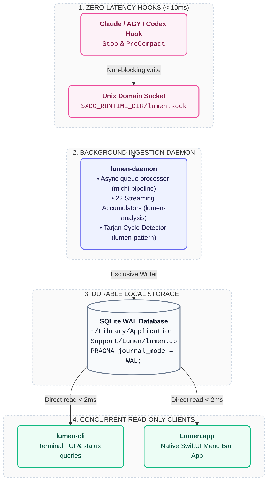

# Local-First SQLite WAL & Single-Writer Daemon Architecture (`docs/06`)

This document defines the storage architecture, daemon concurrency model, SQLite WAL configuration, and IPC communication protocols of Lumen.

---

## 1. The Atuin Concurrency Pattern (Single Writer, Multi-Reader)

Lumen adopts the proven architecture of high-performance local developer tools (like Atuin):
- **Single-Writer Constraint**: `lumen-daemon` is the *only* process that acquires a write lock on SQLite.
- **Concurrent Non-Blocking Readers**: CLI commands (`lumen sessions`, `lumen insights`) and `Lumen for Mac` open SQLite with `PRAGMA query_only = ON;`, executing analytical queries in **`< 2ms`** without acquiring write locks or blocking each other.
- **Zero Lock Contention**: SQLite in WAL (Write-Ahead Logging) mode natively allows infinite concurrent readers while a single writer commits transactions.



---

## 2. Hook Latency Budgets & Execution Contracts

To prevent developers from feeling any lag or freeze when using Claude Code or AGY:
* **`Stop` Hook (`lumen daemon enqueue`)**:
  * **Latency Target**: **`< 10ms` p95**.
  * **Contract**: Inserts one row into `ingestion_queue` via Unix socket. Zero transcript parsing or LLM calls on the hot path.
* **`PreCompact` Hook (`lumen daemon snapshot`)**:
  * **Latency Target**: **`< 50ms` p95**.
  * **Contract**: Saves raw pre-compaction BLOB into `session_snapshots` so cumulative token totals can be reconstructed.

---

## 3. SQLite Schema & The 11 Tables

```sql
-- 1. Ingestion Queue (Queue / Pipeline)
CREATE TABLE IF NOT EXISTS ingestion_queue (
  id INTEGER PRIMARY KEY AUTOINCREMENT,
  provider TEXT NOT NULL,
  session_id TEXT NOT NULL,
  source_path TEXT NOT NULL,
  source_hash INTEGER NOT NULL,
  byte_offset INTEGER NOT NULL DEFAULT 0,
  queued_at TIMESTAMP NOT NULL DEFAULT CURRENT_TIMESTAMP,
  status TEXT NOT NULL DEFAULT 'pending', -- 'pending', 'processing', 'completed', 'dead_letter'
  retry_count INTEGER NOT NULL DEFAULT 0,
  last_error TEXT,
  next_retry_at TIMESTAMP
);

-- 2. Pre-Compaction Snapshots
CREATE TABLE IF NOT EXISTS session_snapshots (
  provider TEXT NOT NULL,
  session_id TEXT NOT NULL,
  snapshot_data BLOB NOT NULL,
  byte_offset INTEGER NOT NULL,
  entry_count INTEGER NOT NULL,
  snapshot_at TIMESTAMP NOT NULL DEFAULT CURRENT_TIMESTAMP,
  PRIMARY KEY (provider, session_id, byte_offset)
);

-- 3. Normalized Session Facts
CREATE TABLE IF NOT EXISTS sessions (
  id TEXT PRIMARY KEY,
  provider TEXT NOT NULL,
  provider_session_id TEXT NOT NULL,
  source_path TEXT NOT NULL,
  source_hash INTEGER NOT NULL,
  started_at TIMESTAMP NOT NULL,
  ended_at TIMESTAMP NOT NULL,
  active_ms INTEGER NOT NULL,
  wall_ms INTEGER NOT NULL,
  repo_name TEXT,
  repo_org TEXT,
  branch TEXT,
  model TEXT NOT NULL,
  total_cost_usd REAL NOT NULL,
  user_prompt_count INTEGER NOT NULL,
  tool_call_count INTEGER NOT NULL,
  bimodal_mode TEXT NOT NULL, -- 'acceleration', 'exploration'
  ingested_at TIMESTAMP NOT NULL DEFAULT CURRENT_TIMESTAMP,
  pipeline_version TEXT NOT NULL,
  UNIQUE(provider, provider_session_id)
);

-- 4. Tool Calls Extracted
CREATE TABLE IF NOT EXISTS tool_calls (
  id INTEGER PRIMARY KEY AUTOINCREMENT,
  session_id TEXT NOT NULL REFERENCES sessions(id) ON DELETE CASCADE,
  tool_name TEXT NOT NULL,
  call_index INTEGER NOT NULL,
  input_size_bytes INTEGER NOT NULL,
  result_size_bytes INTEGER NOT NULL,
  has_error BOOLEAN NOT NULL DEFAULT 0,
  error_snippet TEXT,
  timestamp_ms INTEGER NOT NULL
);

-- 5. Command Events (Sanitized Redacted Shapes)
CREATE TABLE IF NOT EXISTS command_events (
  id INTEGER PRIMARY KEY AUTOINCREMENT,
  session_id TEXT NOT NULL REFERENCES sessions(id) ON DELETE CASCADE,
  call_index INTEGER NOT NULL,
  command_base TEXT NOT NULL,
  args_redacted TEXT NOT NULL,
  exit_code INTEGER,
  rtk_observed BOOLEAN NOT NULL DEFAULT 0,
  timestamp_ms INTEGER NOT NULL
);

-- 6. Token Usage per Session & Model
CREATE TABLE IF NOT EXISTS token_usage (
  id INTEGER PRIMARY KEY AUTOINCREMENT,
  session_id TEXT NOT NULL REFERENCES sessions(id) ON DELETE CASCADE,
  model TEXT NOT NULL,
  input_tokens INTEGER NOT NULL,
  output_tokens INTEGER NOT NULL,
  cache_read_tokens INTEGER NOT NULL,
  cache_write_tokens INTEGER NOT NULL,
  cost_usd REAL NOT NULL
);

-- 7. Structured Findings with Actionable Recommendations
CREATE TABLE IF NOT EXISTS findings (
  id INTEGER PRIMARY KEY AUTOINCREMENT,
  session_id TEXT NOT NULL REFERENCES sessions(id) ON DELETE CASCADE,
  category_slug TEXT NOT NULL,
  rule_id TEXT NOT NULL,
  severity TEXT NOT NULL, -- 'info', 'warning', 'critical'
  confidence REAL NOT NULL,
  evidence_json TEXT NOT NULL,
  recommendation TEXT NOT NULL,
  rule_or_model_version TEXT NOT NULL,
  created_at TIMESTAMP NOT NULL DEFAULT CURRENT_TIMESTAMP,
  suppressed BOOLEAN NOT NULL DEFAULT 0
);

-- 8. Rollups: per-repo, per-category, per-week
CREATE TABLE IF NOT EXISTS rollups (
  id INTEGER PRIMARY KEY AUTOINCREMENT,
  rollup_type TEXT NOT NULL, -- 'weekly_repo', 'weekly_category'
  dimension_key TEXT NOT NULL,
  period_start TIMESTAMP NOT NULL,
  period_end TIMESTAMP NOT NULL,
  session_count INTEGER NOT NULL,
  total_cost_usd REAL NOT NULL,
  payload_json TEXT NOT NULL,
  computed_at TIMESTAMP NOT NULL DEFAULT CURRENT_TIMESTAMP,
  pipeline_version TEXT NOT NULL
);
```

---

## 4. Resilient Dead-Letter Queue Handling

To guarantee the daemon never crashes or gets stuck in an infinite loop on poisoned transcripts:
1. **Linear/Exponential Backoff**: Retries at $1\text{s}, 5\text{s}, 30\text{s}$.
2. **Dead-Letter Transition**: After 3 failed attempts, status is marked `dead_letter` and `last_error` is recorded for diagnostic inspection via `lumen doctor`.
3. **FNV-1a Hashing**: Fast 64-bit hashing via `michi-resilience` computes `source_hash` to detect if the file on disk was modified before reprocessing.
