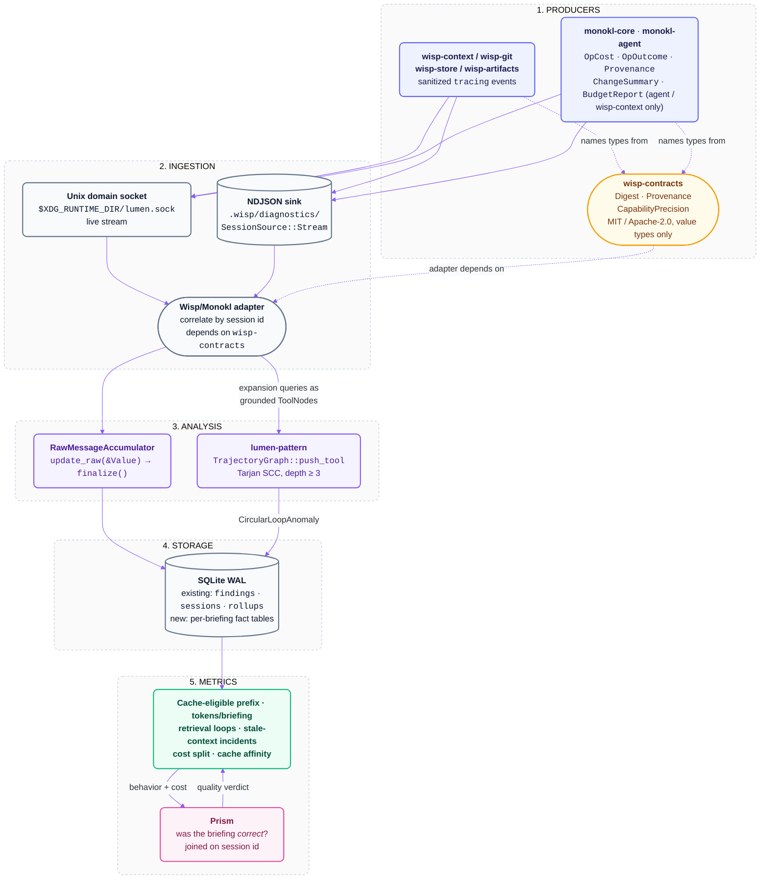

# Lumen Architecture: Wisp & Monokl Telemetry (`11-wisp-and-monokl-telemetry.md`)

> **Status: Vision / Roadmap.** This document describes a target integration, not the current implementation. Wisp and Monokl are unbuilt at the time of writing, no Wisp/Monokl ingestion path exists in this workspace, and the store tables §3.3 marks as additions do not exist yet. Every type and decision attributed to Wisp or Monokl is cited to their specification documents, not to shipped code. Docs 01-06 describe the implemented Lumen system and take precedence wherever the two conflict.

This document defines what [Wisp](https://github.com/orin-axi/wisp) (context compiler) and [Monokl](https://github.com/orin-axi/monokl) (code intelligence) emit as `tracing` events, and what Lumen measures from them. It is the counterpart to Wisp's own `docs/02-architecture-and-contracts.md` §13, whose Lumen row reads: *"Measures whether Wisp improves agent behavior — context size, cache affinity, tool-loop cycles, retries, cost. Wisp emits sanitized tracing; transcripts never enter canonical knowledge without consent and a separate provenance class."*

---

## 1. The boundary

Lumen is an evaluation and telemetry companion. It is never project truth.

The asymmetry is deliberate and runs one way. Wisp's canonical knowledge is Git-tracked JSON artifacts, Git history, and Monokl's code evidence (Wisp D-001, D-003). Transcripts Lumen parses, and observations Lumen derives from them, do not enter that set. Wisp's architecture states the condition under which they could: explicit consent plus a separate provenance class, distinct from `EvidenceSource::CanonicalArtifact` and `CanonicalGit`. Absent both, a Lumen finding is a diagnostic about the agent, not a fact about the codebase, and no Wisp briefing may cite it.

The reverse direction — Wisp to Lumen — is the subject of this document, and it carries no code and no prose.

### 1.1 What "sanitized" excludes

Wisp and Monokl emit structured `tracing` events. Every event is a fixed set of typed fields. The following never appear in any field:

| Excluded | Emitted instead |
| :--- | :--- |
| Raw file contents, code blocks, extracted spans | Workspace-relative path, `SymbolId`, line span, content `Digest` |
| Artifact bodies (`spec@1`, `plan@1`, `requirement@1` JSON) | Artifact id, canonical path, content `Digest`, freshness class |
| Prose doc, ADR, and commit-message text | Commit SHA, path-filtered commit counts |
| Diff hunks and worktree content | Dirty path list, dirty path count |
| User-authored goal and prompt strings | Stage, task id, criterion ids |
| Secrets, tokens, environment variables | Nothing |
| Absolute paths outside the workspace root | Workspace-relative paths only |
| Anything read out of a harness transcript | Nothing — Wisp does not read transcripts |

One category is deliberately *not* excluded: Wisp's own follow-up expansion queries from the Next-actions and Truncation sections. These are generated by Wisp's compiler, deterministic given the briefing inputs, and contain no user prose. They are also the sole means of detecting the retrieval loop in §4 — an agent re-issuing the same expansion query is invisible without the query text.

Digests cross a process boundary into Lumen, so by Wisp D-009 they are `sha256:`-prefixed in the OCI grammar `algorithm:lowercase-hex`. Monokl's internal `blake3:` cache keys stay inside Monokl; Wisp's `.wisp/` cache keys may be `blake3:` and are emitted only as opaque strings.

---

## 2. Event catalogue

Event names are dotted `tracing` targets. "Emitted by" names the crate that owns the call site.

| Event | Fields | Emitted by | Why Lumen wants it |
| :--- | :--- | :--- | :--- |
| **`wisp.brief.cache`** | `key`, `outcome` (`hit`/`miss`), `inputs_checked`, and on a miss `moved_input { source, recorded: Digest, current: Digest }` | `wisp-store` | Wisp D-011 makes a brief a derived fact whose validity is the *conjunction* of its input digests, so a miss can name the culprit rather than reporting an opaque key mismatch. The miss-culprit histogram is what proves the negative gate "editing an unrelated file does not invalidate an unrelated briefing." |
| **`wisp.brief.section`** | `section`, `ordinal`, `bytes`, `digest` | `wisp-context` | The only way to compute the cache-eligible prefix. Comparing successive briefings' section digests within one session yields the byte-stable leading run, which is exactly what a harness's prompt cache can hit. Drives §4's headline metric. |
| **`wisp.brief.compile`** | `stage`, `task`, `budget`, `tokens_emitted`, `wall_ms`, `git_ms`, `monokl_ms`, `compile_ms` | `wisp-context` | Splits cost per briefing three ways. Without the split, a slow briefing is one number with three possible causes. |
| **`wisp.brief.truncation`** | `category`, `included`, `total`, `omitted_for_budget`, `omitted_below_floor`, `expansion_query` | `wisp-context` | Wisp D-008 and D-018. `omitted_for_budget` and `omitted_below_floor` are different failures: the first says raise the budget, the second says the ranker scored the item below the relevance floor. The `expansion_query` is the loop-detection key. |
| **`wisp.brief.budget`** | `limits { max_tokens, max_bytes, max_items }`, `tokens_used`, `bytes_used`, `truncated`, `measure` (`bytes`/`cl100k_base`/…), and per op the core-reported `OpCost` (`bytes`, `items_returned`, `items_total`, `elapsed_ms`, `precision`, `ceiling_hit`) plus the caller's `OpBudget` (`tokens`, `detail_degraded`) | `wisp-context` — the only budgeter (Wisp D-023); `monokl-core` reports `OpCost` per op and holds no budget | Monokl spec 08 §7.5: `items_total > items_returned` is the only "there is more" signal, and `detail_degraded` records that `Detail::Full` was requested and `Lite` served. Together they separate "Monokl found nothing" from "the budget cut it" — two facts a token count alone conflates. Wisp never links `monokl-agent`, so nothing here comes from it. |
| **`monokl.query.op_outcome`** | `op_index`, `op` kind, `outcome` (`Ok`/`Failed`/`Skipped`), `skip_reason` (`BudgetExhausted`/`Unsupported`/`Deadline`/`NotIndexed`) | `wisp-monokl` | The four `SkipReason` variants have four different fixes. `Unsupported` means the snapshot was `Partial` and `dependents`/`refs` were unsound (spec 08 §5.2). `NotIndexed` is a language-coverage gap. `Deadline` is head-of-line blocking, the cost spec 08 §3.2 names as the price of batching without cancellation. `BudgetExhausted` is a tuning problem. |
| **`monokl.snapshot.currency`** | `check` (`is_current`/`provenance_is_current`), `outcome`, `reason` (`FingerprintMismatch`/`ConfigHashMismatch`/`InputDigestMismatch { path }`) | `wisp-monokl` | `provenance_is_current` is Glean's derived-fact rule with exactly three failure modes (spec 08 §8.2): the workspace fingerprint moved, the analyzer `config_hash` moved, or one `inputs[i].content` moved. Naming which one separates "the workspace changed under Wisp" from "Wisp's own config changed" from "one file was edited." |
| **`monokl.change.summary`** | `reanalyzed` count, `cache_hits` count, `created`, `deleted`, `structure_changed`, `fingerprint` | `wisp-monokl` (from `Workspace::apply_change`) | The code-side cache hit rate. `structure_changed` matters because spec 08 §4.1 predicts a step change: a pure-modification `Change` patches the enrichers, while any create or delete triggers a full index rebuild until `FileIdx` stops being observable. Averaging the two hides it. |
| **`monokl.cache.flush`** | `CacheStats` as returned by `Workspace::flush_cache` (spec 08 §2.2 names the type; its fields are not specified there) | `wisp-monokl` | Attributes parse cost across invocations. Wisp never writes Monokl's cache (Wisp D-007) — it calls `flush_cache()` — so this is the only visibility into that lifecycle. |
| **`wisp.git.subprocess`** | `command` base, `count`, `wall_ms` | `wisp-git` | Wisp D-013 targets exactly one `git status --porcelain=v2 -z --untracked-files=all` per workspace per invocation. The measured spawn floor is ~8.8 ms per `git status --porcelain` call and ~7.3 ms per `git log -1`, independent of repository size; a 50-artifact workspace doing one status and one log per artifact pays ≈800 ms of pure overhead against ~20 ms batched, a ~40× saving that grows with artifact count. A `count` above 1 is a regression with a known price. |
| **`wisp.git.revwalk`** | `since`, `pathspec_count`, `commits_visited`, `wall_ms` | `wisp-git` | Callisto instruments `REVWALK_VISIT_COUNT` for the same reason: freshness cost should be a measured budget before it becomes the reason a briefing is slow. `commits_visited` is the figure that scales with repository history rather than with artifact count. |
| **`wisp.evidence.freshness`** | `link` (artifact id, declared path), `class` (`CleanAtCommit`/`CleanUnaffected`/`CleanBehind`/`DirtyUnaffected`/`DirtyAffected`/`Uncommitted`/`Indeterminate`), `commits_touching`, `dirty_path_count`, `gap_reason` | `wisp-context` | Per link, per briefing. `commits_touching` is path-filtered ("predates 7 commits to `auth.rs`"), never distance-from-HEAD (Wisp D-014). The class is the input to the stale-context incident count in §4. |
| **`wisp.artifact.freshness`** | `artifact`, `class` (`Matches`/`Diverged`/`Missing`), `recorded: Digest`, `current: Digest`, `expected_path` | `wisp-artifacts` | The second freshness axis: did the artifact's own bytes move? `Diverged` on a `plan@1`'s `spec_hash` is spec drift, detectable with no Git at all. |
| **`wisp.evidence.code_item`** | `symbol` (`SymbolId`), `scope` (`Complete`/`Partial { seeds, hops }`), `precision` (`CapabilityPrecision`), `detail` (`Path`/`Skeleton`/`Full`), `routes` | `wisp-context` | Wisp never upgrades confidence and never presents a partial-scope answer as complete. Recording scope and precision per item lets Lumen ask whether agents act differently on `Exact`/`Complete` evidence than on `Structural`/`Partial` evidence. `routes > 1` marks an item selected by more than one derivation route, which Wisp's ranker promotes. |
| **`wisp.artifact.receipt`** | `status` (`validated`/`already_current`/`written_uncommitted`/`persisted`/`commit_declined`/`commit_failed`/`conflict`), `reason` for `commit_declined` (`NotRequested`/`ApprovalDenied`/`NotARepository`/`PolicyDisabled`), `artifact_type`, `id`, `content_hash`, `cache_invalidated` | `wisp-artifacts` | Audited silence. `commit_declined` is not an error and is not `commit_failed`, but it is always recorded — a declined commit must be a recorded state, not an absent one, so silence is never mistaken for a clean check (Wisp D-015). |
| **`wisp.brief.suppressed_warning`** | `warning` class, `profile`, `reason` | `wisp-context` | The same principle applied to briefing profiles. Wisp puts no threshold constant in `EvidenceFreshness`; a profile decides what warns. A profile that warns on nothing is indistinguishable from a clean workspace unless each suppression is logged. |
| **`wisp.impact.edge`** | `artifact`, `affected_by` (`TouchedFile`/`UpstreamLink`/`DownstreamDependent`), `closure` (`direct`/`deep`), `path` | `wisp-context` | moon's `AffectedState` records *why* each project is affected and persists it. Without the reason, `wisp impact` is a list of names an agent cannot audit, and Lumen cannot tell a broad-closure result from a directly-touched one. |

### 2.1 Correlation

Wisp is not an `OrchestratorKind`. It produces no transcript and no session of its own; its events attach to a session some orchestrator already produced. Lumen's existing model has no correlation field for an out-of-band event stream, so the adapter needs one, and this document states the requirement rather than inventing the mechanism:

- **Primary key**: the harness session id, supplied to the `wisp` process by its caller and echoed on every event. This is the same id `CanonicalTranscript::session_id` carries.
- **Fallback**: workspace fingerprint plus timestamp window, when no session id is supplied (a developer running `wisp brief` by hand). Events correlated this way are attributable to a workspace but not to a session, and the metrics in §4 that require a session are not computable for them.

The fallback is lossy on purpose. A correlation Lumen cannot verify is worse than an uncorrelated event.

---

## 3. Where it lands



### 3.1 Which adapter ingests it

Two paths, matching the two ingestion shapes Lumen already has.

**Streaming.** A `tracing` subscriber in the `wisp` process writes to the daemon's Unix domain socket at `$XDG_RUNTIME_DIR/lumen.sock`, the same non-blocking hot path the `Stop` and `PreCompact` hooks use (`docs/06` §2). The same latency contract applies: the emitting process does no parsing and makes no network call, and the event goes on `ingestion_queue` for `lumen-daemon` to drain. Wisp's own budget is tighter than the daemon's `< 10ms` p95 hook target, because a briefing is measured in the tens of milliseconds where a session is measured in minutes.

**File.** A `tracing` subscriber writes newline-delimited JSON under `.wisp/diagnostics/`, Wisp's sanitized-diagnostics directory. This is a `SessionSource::Stream` and reads back through the same `BufRead` path every JSONL adapter uses, with `ingestion_queue.byte_offset` and the FNV-1a `source_hash` handling incremental re-reads and on-disk modification exactly as they do for a transcript.

The file path is the one to build first: it needs no daemon, it is inspectable, and it is what CI produces.

Lumen's existing `SessionAdapter` trait is not the right seam for either path. Its `load` returns `Vec<CanonicalTranscript>`, and Wisp events are not a transcript — they are annotations *on* a transcript another adapter produced. The Wisp/Monokl adapter is therefore a distinct ingestion component, and this document does not name a type for it; Lumen's docs do not define one yet.

### 3.2 Which accumulators it feeds

Lumen has two accumulator lifecycles (`docs/03` §1), and Wisp events fit the first one exactly:

- **`RawMessageAccumulator`** — `update_raw(&serde_json::Value)` then `finalize()`. This is the contract for accumulators observing low-level JSON envelopes, which is precisely what a `tracing` event is. `token_usage` already uses it. Every per-briefing counter in §4 is a `RawMessageAccumulator`: cache outcomes, section digests, truncation categories, git subprocess counts, rev-walk visits, freshness classes, receipt states.
- **`EntryAccumulator`** — `update(&CanonicalTurn)`. Wisp events are not turns, so nothing here applies directly. The join to turns happens after both sides are ingested, on session id and timestamp.

Three existing accumulators pick up the joined result without modification. `attribution` already attributes token spend hierarchically Plugin → Skill → Subagent, and a briefing consumed inside a skill's execution window lands under that skill. `context_growth` already tracks growth rate and compaction events, which is the denominator for "did the briefing reduce context pressure." `artifacts` already collects created and edited file paths, which is one half of the stale-context join in §4.

### 3.3 How it lands in the SQLite store

| Fact | Table | Status |
| :--- | :--- | :--- |
| Ingestion bookkeeping | `ingestion_queue` — `provider`, `session_id`, `source_path`, `source_hash`, `byte_offset`, `status`, `retry_count` | Existing. Backoff at 1s/5s/30s and `dead_letter` after 3 attempts apply unchanged. |
| Stale-context incidents, retrieval loops, suppressed-warning counts | `findings` via `FindingsRepository`, as `FindingFactRecord { rule_id, severity, confidence, title, message, evidence_json }` | Existing. `rule_id` values are namespaced, e.g. `wisp.stale_context`, `wisp.retrieval_loop`, `wisp.git_subprocess_regression`. |
| Circular loop over expansion queries | `sessions.has_anomalies`, read back through `SessionSummaryReadModel.has_anomalies` | Existing. `CircularLoopAnomaly` from `lumen-pattern` already flows here. |
| Weekly and per-repo aggregates | `rollups` via `RollupRepository` | Existing. |
| One row per `wisp brief` invocation: brief key, stage, task, cache outcome, tokens emitted, `git_ms`/`monokl_ms`/`compile_ms`, git subprocess count, rev-walk commits visited | New table | Schema addition. Requires a migration in `MigrationManager::apply_migrations`. |
| Per-briefing section digests, for the byte-stable prefix | New table | Schema addition. One row per section per briefing. |
| Per-link freshness class per briefing | New table | Schema addition. |

Until the three new tables exist, the per-briefing facts can be parked in `findings.evidence_json` — queryable, but not aggregatable in SQL, which is why the tables are worth adding rather than working around.

The single-writer constraint is unchanged: `lumen-daemon` is the only process holding a write lock, and CLI and app readers open with `PRAGMA query_only = ON`.

### 3.4 How the trajectory DAG represents a briefing chain

`lumen-pattern` models tool calls as `DiGraph<ToolNode, ()>` and closes a back-edge whenever a node's grounded key — `target_symbol`, falling back to `target_file` — has been seen before. Tarjan's SCC then flags any component of depth $\ge 3$ whose nodes share that key and perform no mutation.

A briefing chain maps onto this directly:

1. A `wisp_brief` call becomes a `ToolNode` with `tool_name: "wisp_brief"` and `is_mutation: false`.
2. Each follow-up expansion query from the briefing's Truncation and Next-actions sections becomes a `ToolNode` whose `target_symbol` is the normalized query string.
3. Re-issuing the same expansion query closes a back-edge on that key, per `TrajectoryGraph::push_tool`.
4. Three or more such revisits with no intervening mutation form an SCC and emit a `CircularLoopAnomaly { symbol, cycle_depth }`, surfacing as `TrajectoryAnomaly::CircularLoop`.

This is Lumen's existing loop detection with no new algorithm, and the 500-node graph benchmark (`~11 µs`) already bounds its cost.

**One gap to close in the adapter.** `ground_tool_intent` in `lumen-pattern` returns `(None, None, false)` for `ToolIntent::McpCall { server, method }`, and a `wisp_brief` MCP call is an `McpCall`. Ungrounded nodes produce a linear chain and no cycle is topologically possible, so the loop above is undetectable unless the adapter maps the expansion query onto a grounded intent. `ToolIntent::CodeSearch { tool, query, is_ast }` already grounds on its `query` and is the closest fit. This is a mapping decision the adapter must make explicitly; it is not automatic.

---

## 4. Headline metrics

| Metric | Computed from | Definition and why |
| :--- | :--- | :--- |
| **KV-cache hit rate for briefing-consuming sessions** | `wisp.brief.section` digests joined to the session's existing `TokenEconomics.cache_hit_ratio` | Manus reports KV-cache hit rate as "the single most important metric for a production-stage AI agent," at a 100:1 input:output ratio with cached tokens at $0.30/M against $3/M uncached — a 10× difference. Lumen already computes $H$ over the four token tiers (`docs/01` §2B); the new part is attribution. The **cache-eligible prefix** is the longest run of leading sections whose digests are unchanged from the previous briefing in the same session. Sections stable across invocations (request header, governing artifact pointers and hashes, architecture invariants) are cacheable; volatile ones (git delta, truncation counts, freshness warnings) are not. This is the measurement behind Wisp's default section ordering, which puts session-stable material first — a prior the metric can confirm or refute. |
| **Tokens per briefing against task outcome** | `wisp.brief.compile.tokens_emitted`, joined with Prism's per-task resolve verdict | Lumen supplies the token figure and the trajectory; Prism supplies whether the task was solved. Carry **turn count as a guardrail alongside cost**: JetBrains found that replacing out-of-window observations with a placeholder ("`Old environment output: (42 lines omitted)`") gave +2.6% solve rate at 52% lower cost, while LLM summarization achieved comparable savings but lengthened trajectories ~15% by masking termination signals. Both cut cost by over 50%. A briefing that reduces tokens while lengthening the trajectory has moved the cost, not removed it, and `timeline` plus `stats` already measure trajectory length. |
| **Retrieval and tool-loop detection over `next_actions`** | `wisp.brief.truncation.expansion_query`, through `lumen-pattern` per §3.4 | An agent re-issuing the same expansion query is looping. This is Lumen's trajectory DAG applied to Wisp: same `TrajectoryGraph`, same Tarjan SCC, same depth $\ge 3$ threshold, with the expansion query as the grounded key instead of a file path. A loop here means either the expansion did not return what the agent needed, or the briefing failed to state that the material does not exist. |
| **Stale-context incidents** | `wisp.evidence.freshness` and `wisp.artifact.freshness` joined to the `artifacts` accumulator's edited paths | An incident is a turn that edits a path whose most recent freshness class was `CleanBehind` or `DirtyAffected` (the `EvidenceFreshness` axis — code moved under the artifact), or whose artifact was `Diverged` (the `ArtifactFreshness` axis — the artifact's own bytes moved since the consumer recorded them). Two axes, kept separate because they answer different questions, and an agent acting on either is acting on evidence Wisp had already labelled stale. |
| **Cost per briefing, split three ways** | `wisp.brief.compile` `git_ms` / `monokl_ms` / `compile_ms`, cross-checked against `wisp.git.subprocess` and `wisp.git.revwalk` | Three causes, three different fixes. The git share has a known floor: ~8.8 ms per `git status --porcelain` spawn and ~7.3 ms per `git log -1`, so a subprocess count above 1 per invocation is a measurable regression against Wisp D-013's target, worth ≈800 ms against ~20 ms at 50 artifacts. The Monokl share splits again by `monokl.change.summary` (reanalysis) against `monokl.query.budget` (query). The compile share is Wisp's own ranking and budgeting. |
| **Cache affinity over a session** | `wisp.brief.cache.outcome`, per session | The fraction of briefings served warm. A session whose affinity falls as it progresses is invalidating its own cache — the miss-culprit histogram from `moved_input` names which input digest is responsible, which is the whole reason validity is stored as a conjunction of digests rather than one composite key. |

Supporting counters worth tracking but not headline: `detail_degraded` rate and the fraction of ops where `items_total > items_returned` (budget pressure on the Monokl side), the `SkipReason` distribution, `commit_declined` reason distribution, and the ratio of suppressed to surfaced freshness warnings.

One note on the truncation record's justification, since it drives several of these counters: models cannot detect what is absent. On AbsenceBench, Claude-3.7-Sonnet reaches only 69.6% F1 at a 5K-token average context, against near-perfect Needle-in-a-Haystack performance, because attention has no key corresponding to a gap. An itemized truncation record is therefore the only way an agent learns that material was omitted — and it is also the only way Lumen learns it.

---

## 5. Event shapes reference `wisp-contracts`

The Wisp/Monokl adapter depends on **`wisp-contracts`**, and on neither `wisp-model` nor `monokl-core`.

`wisp-contracts` is the shared vocabulary crate across Wisp and Monokl. It holds value types only, nothing computed: `Digest`, `Provenance` (with `AnalyzerId`, `OperationId`, `InputRef`, `WorkspaceFingerprint`), `CapabilityPrecision`, `Diagnostic`, the `SymbolId` grammar, and the truncation and budget report shapes. It depends on nothing. Its rule for inclusion is stated in Wisp D-010: if Wisp and Monokl must agree on the meaning of a type, it goes in contracts; if Monokl computes it, it stays in `monokl-core`.

The dependency direction is therefore:

```text
lumen Wisp/Monokl adapter  ──depends on──▶  wisp-contracts  ──depends on──▶  (nothing)

                            ✗ never ──▶  wisp-model
                            ✗ never ──▶  monokl-core
```

Two reasons this is the required direction rather than a preference.

**Licensing.** `wisp-contracts` and `wisp-model` are `MIT OR Apache-2.0` under Wisp D-021, but everything above `wisp-model` takes the Wisp suite license, and `monokl-core` is not permissive. Lumen's Layer 1.5 (`lumen-session`) must stay `MIT OR Apache-2.0` at the package-license level — `AGENTS.md` §1 makes this a critical rule with `deny.toml` `[bans]` enforcement behind it. An adapter depending on `monokl-core` could not live at Layer 1.5.

**Coupling.** Lumen consumes a wire format, not an API. `Provenance` is `serde`-derived because it *is* the wire format. Reading a `Digest` or a `CapabilityPrecision` off an event requires the type's shape and nothing else; depending on the crate that computes it would pull an analyzer, a parse cache, and a workspace index into a telemetry reader.

`BudgetReport`, `OpBudget`, `OpCost`, `OpOutcome`, and `SkipReason` are `wisp-contracts` types. `monokl-core` emits `OpCost` per op and holds no budget; a `BudgetReport` is emitted by whichever caller allocated one — `monokl-agent` for the CLI, `wisp-context` for a briefing (Wisp D-023). `ChangeSummary` and `CacheStats` are `monokl-core`'s own; the adapter does not import them and reads their serialized field sets off the event stream, which is why §2 lists fields rather than type paths for those two events.

---

## 6. What Lumen does not do here

Lumen makes **no judgment about whether a briefing was correct**.

Lumen can say a briefing cost 6,200 tokens, compiled in 340 ms of which 180 ms was Monokl, was served from a warm cache, held a 4,100-byte cache-eligible prefix, omitted 14 items for budget and 3 below the relevance floor, and was followed by an agent that re-issued the same expansion query three times. Every one of those is an observation about behavior and cost.

Lumen cannot say whether the right files were selected, whether the omitted 14 items were the ones that mattered, or whether the agent would have solved the task faster without Wisp. Those are quality questions, and they belong to **Prism** (Wisp D-020), in two tiers:

- **Intrinsic** — scoring emitted briefings directly against ground-truth changed lines: line-level coverage, nDCG ranking, context efficiency, and a budget sweep, computed deterministically per commit.
- **Extrinsic** — a paired run of the same harness with and without Wisp, at least 3 seeds, with cost per solved task as the headline. Within-harness is the defensible claim; cross-harness wins are not.

Prism already consumes Lumen's primitives directly rather than reimplementing them — `lumen-model` for the canonical IR and pricing, `lumen-session` for parsers, `lumen-analysis` for accumulators, `lumen-pattern` for Tarjan cycles. See Prism's [`docs/05-lumen-integration-and-closed-loop-flywheel.md`](../../prism/docs/05-lumen-integration-and-closed-loop-flywheel.md). The join for Wisp telemetry runs on session id: Lumen supplies the behavior and cost columns, Prism supplies the verdict column, and the closed loop is the same one that flywheel already describes — observe, capture as a fixture, iterate, verify.

The division holds in both directions. A Prism verdict is not a Lumen metric, and neither is project truth. Both stay on the evaluation side of the boundary in §1.
